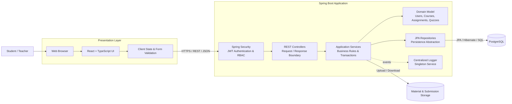
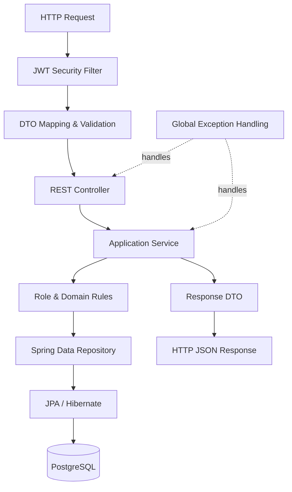
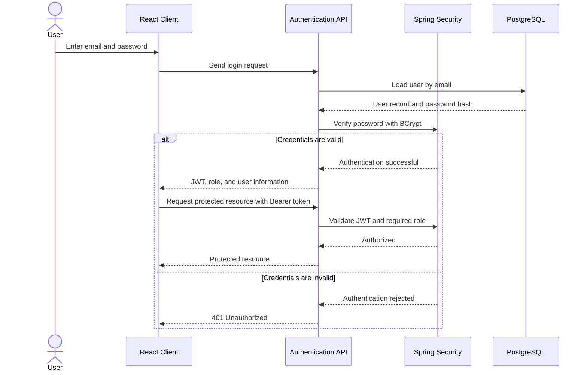
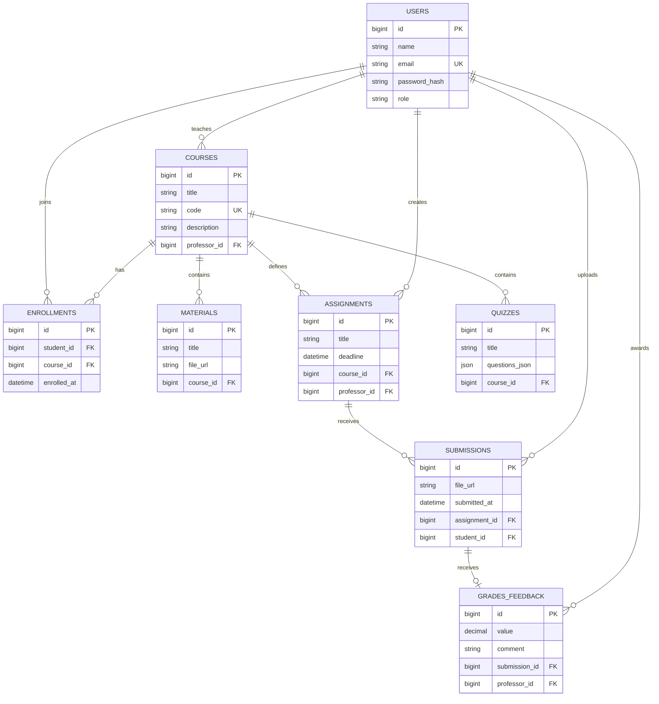
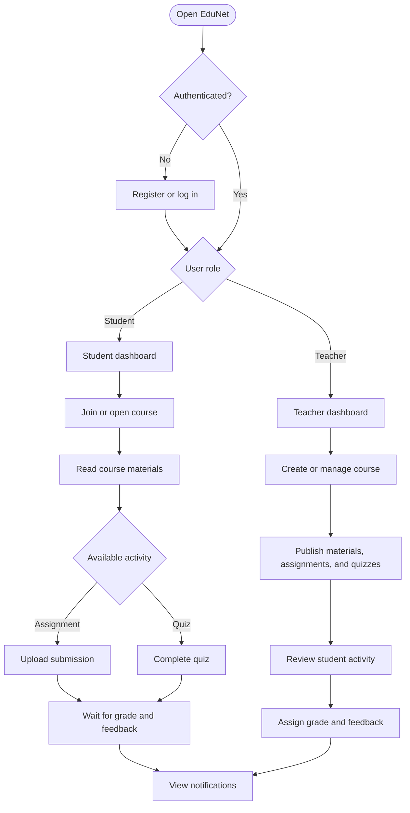

<div align="center">

# EduNet

### Full-stack Learning Management System for students and teachers

EduNet centralizes course delivery, learning materials, assignments, quizzes, submissions, grading, feedback, and role-based access in a single browser-based platform.


</div>

---

## Overview

**EduNet** is a web-based Learning Management System designed around the complete student–teacher workflow.

Students can join courses, access educational materials, submit assignments, complete quizzes, and receive grades and feedback. Teachers can create and manage courses, publish content, define assessments, review submissions, and evaluate student work.

The application follows a **client–server architecture**. A React frontend communicates with a Java Spring Boot backend through a JSON-based REST API. The backend applies authentication, authorization, validation, and domain rules before persisting data in PostgreSQL through JPA/Hibernate.

## Core capabilities

### Student

- Create an account and authenticate securely
- Browse and join courses using an enrollment code
- Access course materials
- View assignment requirements and deadlines
- Upload assignment submissions
- Complete course quizzes
- View grades and teacher feedback
- Receive course and assessment notifications
- Communicate through the platform messaging flow

### Teacher

- Authenticate with teacher-level permissions
- Create and manage courses
- Publish educational materials
- Create assignments and define deadlines
- Create quizzes associated with a course
- Review student submissions
- Assign grades and written feedback
- Notify and communicate with enrolled students

## Technology stack

| Area | Technology | Responsibility |
|---|---|---|
| Frontend | React, TypeScript, JSX, CSS | Responsive user interface and client-side interaction |
| Frontend tooling | Node.js, npm | Dependency management and frontend build tooling |
| Backend | Java, Spring Boot, Spring MVC | REST API, application orchestration, and business logic |
| Security | Spring Security, JWT, BCrypt | Authentication, password hashing, and role-based authorization |
| Persistence | Spring Data JPA, Hibernate | Entity mapping and repository-based data access |
| Database | PostgreSQL | Relational persistence and referential integrity |
| Build | Maven | Backend dependency management and build lifecycle |
| Communication | HTTP/HTTPS, REST, JSON | Data exchange between the web client and server |
| File handling | File storage abstraction | Course materials and assignment submission files |

> Node.js is used for the React development toolchain. The application backend is implemented with Java and Spring Boot.

---

## System architecture

EduNet uses a layered architecture that separates presentation, application logic, domain rules, persistence, and infrastructure concerns.



### Architectural responsibilities

| Layer | Main responsibility |
|---|---|
| Presentation | Renders the UI, collects user input, and sends authenticated requests |
| Security | Validates credentials and JWTs, hashes passwords, and enforces roles |
| Controller | Exposes REST resources and maps HTTP data to application DTOs |
| Service | Implements use cases, validation rules, transactions, and authorization checks |
| Domain | Represents the core educational concepts and relationships |
| Repository | Isolates persistence operations behind Spring Data interfaces |
| Database | Stores relational data and enforces key constraints |
| File storage | Stores downloadable materials and uploaded assignment files |

## Backend design

The backend follows a controller–service–repository structure. Business logic remains in the service layer instead of being placed directly in controllers or persistence classes.



### Design principles

- **Separation of concerns** — UI, business logic, persistence, and security are isolated.
- **Dependency direction** — controllers depend on services; services depend on repository abstractions.
- **DTO boundary** — API payloads are separated from persistence entities.
- **Service-layer invariants** — enrollment, submission, grading, and ownership rules are validated centrally.
- **Role-based access control** — student and teacher operations are authorized independently.
- **Relational integrity** — primary and foreign keys protect the consistency of educational data.
- **Centralized logging** — relevant authentication, application, and error events are recorded through one logging component.

---

## Authentication and authorization flow

EduNet uses token-based authentication. Passwords are stored as BCrypt hashes, while authenticated requests carry a JWT that identifies the user and role.



### Security model

- Passwords are never stored in plain text.
- JWTs provide stateless authentication for REST requests.
- Protected operations are checked against the authenticated role.
- A student cannot perform teacher-only operations.
- A teacher can modify only resources that belong to courses they manage.
- Validation is applied at both the request boundary and business layer.
- Secrets and database credentials must remain outside version control.

---

## Domain and relational data model

The data model uses a single `users` table for students and teachers, differentiated by the `role` field. The `enrollments` table resolves the many-to-many relationship between students and courses.



### Important data constraints

- `users.email` must be unique.
- `courses.code` must be unique and is used for enrollment.
- A student–course pair should appear only once in `enrollments`.
- A student should have at most one active submission per assignment, unless resubmission is explicitly supported.
- A grade must reference an existing submission and the evaluating teacher.
- Course-owned resources must reference a valid course.
- Foreign-key rules should prevent orphaned materials, assignments, submissions, and grades.

---

## Main application workflow



---

## Role and permission matrix

| Capability | Student | Teacher |
|---|:---:|:---:|
| Register and authenticate | ✓ | ✓ |
| View available courses | ✓ | ✓ |
| Join a course | ✓ | — |
| Create and manage a course | — | ✓ |
| Access course materials | ✓ | ✓ |
| Publish course materials | — | ✓ |
| Submit an assignment | ✓ | — |
| Create an assignment | — | ✓ |
| Complete a quiz | ✓ | — |
| Create a quiz | — | ✓ |
| View own grades and feedback | ✓ | — |
| Grade submissions and add feedback | — | ✓ |
| Receive notifications | ✓ | ✓ |
| Use internal communication | ✓ | ✓ |

---

## Logical module organization

```text
EduNet/
├── frontend/
│   ├── src/
│   │   ├── api/             # REST client and request configuration
│   │   ├── components/      # Reusable UI components
│   │   ├── features/        # Auth, courses, assignments, quizzes, grading
│   │   ├── pages/           # Route-level views
│   │   ├── hooks/           # Reusable React logic
│   │   ├── types/           # TypeScript domain and API types
│   │   └── styles/          # Global and feature styles
│   └── package.json
│
├── backend/
│   ├── src/main/java/.../
│   │   ├── config/          # Application configuration
│   │   ├── security/        # JWT, filters, authentication, authorization
│   │   ├── controller/      # REST controllers
│   │   ├── dto/             # Request and response contracts
│   │   ├── service/         # Use cases and business rules
│   │   ├── repository/      # Spring Data JPA repositories
│   │   ├── model/           # JPA entities and domain enums
│   │   └── exception/       # Domain exceptions and global handlers
│   ├── src/main/resources/
│   │   └── application.properties
│   └── pom.xml
│
├── docs/                    # Requirements and architecture documentation
└── README.md
```

> Directory names can be adjusted to match the current repository while preserving the same separation of responsibilities.

---

## API organization

The REST API is organized around domain resources rather than UI screens.

| Resource area | Responsibility |
|---|---|
| Authentication | Registration, login, JWT issuance, current-user context |
| Users | User profile and role information |
| Courses | Course creation, lookup, update, and enrollment |
| Materials | Course material metadata and file access |
| Assignments | Assignment creation, deadlines, and course association |
| Submissions | Student file upload and submission status |
| Quizzes | Quiz definition, questions, and student attempts |
| Grades & feedback | Evaluation of assignment submissions |
| Notifications | Course, deadline, submission, and grading events |
| Messaging | Communication between platform users |

A consistent API should use:

- resource-oriented URLs;
- appropriate HTTP methods;
- request and response DTOs;
- meaningful status codes;
- centralized validation errors;
- pagination for growing collections;
- authenticated user context instead of client-supplied ownership data.

---

## Business rules

Examples of service-layer rules enforced by the platform:

1. Only authenticated users can access protected resources.
2. Only teachers can create courses, assignments, materials, quizzes, grades, and feedback.
3. Students must be enrolled before accessing protected course resources.
4. A submission must reference both an existing student and assignment.
5. The assignment must belong to a course in which the student is enrolled.
6. Submission deadlines are validated before accepting an upload.
7. Duplicate enrollment is rejected.
8. Duplicate submissions are rejected unless resubmission is supported.
9. A teacher can grade only submissions associated with courses they own.
10. Search, sorting, and filtering are applied to course and assessment collections.

---

## Quality attributes

- **Maintainability** — layered organization and explicit module boundaries
- **Security** — hashed passwords, JWT validation, and role-based authorization
- **Portability** — browser-based client available across major operating systems
- **Usability** — responsive UI and role-specific dashboards
- **Scalability** — stateless REST authentication and separated application layers
- **Data integrity** — normalized relational model and foreign-key constraints
- **Testability** — business logic isolated in services and persistence hidden behind repositories


<div align="center">

Built with React, Spring Boot, and PostgreSQL.

</div>
